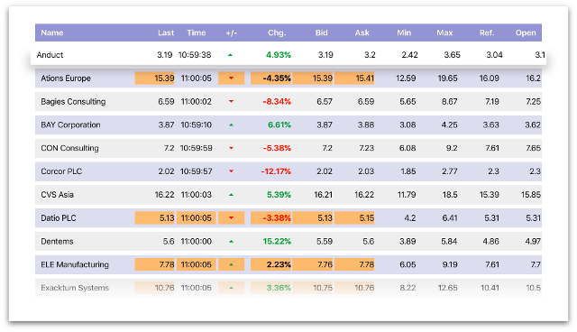

# Lightstreamer - Stock-List Demo - tvOS Client

<!-- START DESCRIPTION lightstreamer-example-stocklist-client-tvos -->

This project contains an example of application for Apple TV 4th generation that employs the [Lightstreamer tvOS Client library](http://www.lightstreamer.com/api/ls-tvos-client/latest_4_0/).

## Live Demo

[](https://itunes.apple.com/us/app/lightstreamer-stock-list-for/id1089549368?mt=8)<br>
### [ View live demo](https://itunes.apple.com/us/app/lightstreamer-stock-list-for/id1089549368?mt=8)<br>

This is how it looks on a real TV:


## Details

This app is an Objective-C version of the [Stock-List Demos](https://github.com/Lightstreamer/Lightstreamer-example-Stocklist-client-javascript).<br>

This app uses the <b>tvOS Client API for Lightstreamer</b> to handle the communications with Lightstreamer Server. A simple user interface is implemented to display the real-time data received from Lightstreamer Server.<br>

## Install

Binaries for the application are not provided, but it may be downloaded from the App Store at [this address](https://itunes.apple.com/us/app/lightstreamer-stock-list-for/id1089549368?mt=8). The downloaded app will connect to Lightstreamer's online demo server.

## Build

A full Xcode project specification, ready for compilation of the app sources, is provided. Please recall that you need a valid Apple Developer Program membership to run or debug your app on a test device.

### Getting Started

Before you can build this demo, you need to install CocoaPods to handle the project dependency on the Lightstreamer tvOS client library (see also the Lightstreamer Compatiblity Notes below).

Follow these steps:

* open a terminal and run the following command:

```sh
$ sudo gem install cocoapods
```

* `cd` into the directory where you downloaded this project and run the following command:

```sh
$ pod install
```

* CocoaPods should now resolve the dependency on the Lightstreamer tvOS client library and prepare a workspace for you.

Done this, open the workspace with Xcode and it should compile with no errors. In case of errors during dependency resolution, you can find more information on [CocoaPods official website](https://cocoapods.org).


### Compile and Run

A full local deploy of this app requires a Lightstreamer Server 6.0 or greater installation. Follow these steps:

* Set the IP address of your local Lightstreamer Server in the constant `PUSH_SERVER_URL`, defined in `Constants.h`; a ":port" part can also be added.
* Follow the installation instructions for the Data and Metadata adapters required by the demo, detailed in the [Lightstreamer - Basic Chat Demo - Java Adapter](https://github.com/Lightstreamer/Lightstreamer-example-Chat-adapter-java) project.

Done this, the app should run correctly on the simulator and connect to your server.

## See Also

### Lightstreamer Adapters Needed by This Demo Client

* [Lightstreamer - Stock- List Demo - Java Adapter](https://github.com/Lightstreamer/Lightstreamer-example-Stocklist-adapter-java)
* [Lightstreamer - Reusable Metadata Adapters- Java Adapter](https://github.com/Lightstreamer/Lightstreamer-example-ReusableMetadata-adapter-java)

### Related Projects

* [Lightstreamer - Stock-List Demos - HTML Clients](https://github.com/Lightstreamer/Lightstreamer-example-Stocklist-client-javascript)
* [Lightstreamer - Basic Stock-List Demo - iOS Client](https://github.com/Lightstreamer/Lightstreamer-example-StockList-client-ios)
* [Lightstreamer - Stock-List Demo with APNs Push Notifications - iOS Client](https://github.com/Lightstreamer/Lightstreamer-example-MPNStockList-client-ios)
* [Lightstreamer - Stock-List Demo - Android Client](https://github.com/Lightstreamer/Lightstreamer-example-AdvStockList-client-android)
* [Lightstreamer - Basic Stock-List Demo - Windows Phone Client](https://github.com/Lightstreamer/Lightstreamer-example-StockList-client-winphone)

## Lightstreamer Compatibility Notes

* Code compatible with Lightstreamer tvOS Client Library version 3.0.0-beta or newer.
* For Lightstreamer Allegro (+ tvOS Client API support), Presto, Vivace. Server compatibility depends on the tvOS Client Library in use, which is specified in the `Podfile`:
  * By default the project uses tvOS Client Library version 4.0.0, which requires a Server version 7.0 b2 or newer.
  * Use tvOS Client Library version 3.0.1 for compatibility with Server version 6.1.
* For a version of this example compatible with Lightstreamer tvOS Client API version 1.x, please refer to [this tag](https://github.com/Lightstreamer/Lightstreamer-example-StockList-client-tvos/tree/latest-for-client-1.x).
